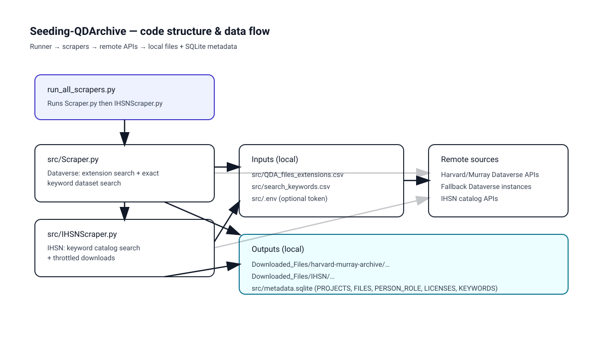

# Seeding-QDArchive (Part 1) — Data Acquisition

Automated discovery and downloading of qualitative-data-analysis (QDA) related datasets from:

- **Harvard Dataverse / Murray Research Archive** (Dataverse-based)
- **International Household Survey Network (IHSN)** catalog

The pipeline searches for QDA-relevant projects, downloads full datasets (not only the matching file), and stores **files + metadata** locally for later analysis.



## Repository layout

```
.
├── run_all_scrapers.py          # runs both scrapers sequentially
├── requirements.txt
└── src/
    ├── Scraper.py               # Dataverse (Harvard/Murray) scraper
    ├── IHSNScraper.py           # IHSN scraper
    ├── metadata.sqlite          # SQLite metadata DB (created/updated by scrapers)
    ├── QDA_files_extensions.csv # QDA tool extensions used in Dataverse file search
    ├── search_keywords.csv      # exact-match keyword phrases
    └── .env                     # optional tokens/secrets (ignored by git)
```

## Method (high level)

### 1) Dataverse (Harvard/Murray) — `src/Scraper.py`

Two phases are used:

1. **Extension-based file search (first run only)**  
   Loads QDA-related file extensions from `src/QDA_files_extensions.csv` and queries the Dataverse Search API for files matching `fileType:.ext`. When a match is found, the **entire dataset** is downloaded.
2. **Exact-match keyword dataset search**  
   Loads phrases from `src/search_keywords.csv` and searches datasets using exact phrase matching (quoted queries) to reduce noise.

Some datasets are hosted on external Dataverse instances; the scraper includes fallback metadata calls to additional Dataverse base URLs when needed.

### 2) IHSN — `src/IHSNScraper.py`

Performs keyword-based catalog searches (using the same `src/search_keywords.csv` phrases), then downloads full study datasets. Requests are throttled with retries to reduce the chance of being blocked.

## Outputs

### Download rules (high level)

- **Full-dataset download**: if a QDA-relevant signal is found, the complete dataset is downloaded.
- **Restricted content**: recorded in the DB; may be skipped depending on repository response.
- **Large / multimedia**: common video/audio formats are skipped; very large files are skipped (default cap: ~500 MB).
- **Rate limiting**: Dataverse requests may pause and retry when 403 rate limits are encountered.

### Download folders

Downloads are written under `Downloaded_Files/` (this folder is ignored by git via `.gitignore`):

- `Downloaded_Files/harvard-murray-archive/…`
- `Downloaded_Files/IHSN/…`

Each dataset is stored in its own folder (named with a stable repository-specific identifier).

### Metadata database (SQLite)

Both scrapers write to `src/metadata.sqlite` with these main tables:

- `PROJECTS` — dataset-level metadata (title, description/abstract, URLs, dates, etc.)
- `FILES` — file-level entries + download status
- `PERSON_ROLE` — creators/authors and their roles
- `LICENSES` — license text/info
- `KEYWORDS` — keywords normalized into one row per keyword

File download status values:

- `SUCCEEDED` — downloaded
- `FAILED` — attempted but failed
- `SKIPPED` — intentionally not downloaded (e.g., restricted, large multimedia, over size cap)

## Setup

1. Install dependencies:
   - `pip install -r requirements.txt`
2. (Optional) add Dataverse API token:
   - Create `src/.env` with: `DATAVERSE_API_TOKEN=...`

IHSN tuning via environment variables (optional):

- `IHSN_THROTTLE_SLEEP_SECONDS` (default `600`)
- `IHSN_THROTTLE_MAX_RETRIES` (default `3`)
- `IHSN_PAGE_SIZE` (default `50`)
- `IHSN_MAX_STUDIES_PER_KEYWORD` (default `0`, meaning “no limit”)

## Run

- Run both scrapers (recommended):
  - `python run_all_scrapers.py`
- Or run individually:
  - `python src/Scraper.py`
  - `python src/IHSNScraper.py`

## Results (from the accompanying report)

In one run documented in the project report:

- Harvard Dataverse/Murray: **602 projects**, **9,559 files**
- IHSN: **1,447 projects**, **6,998 files**
- Total: **2,049 projects**, **16,557 files**

Counts will vary depending on keywords, extensions, and when the scrape is performed.

## License

See `LICENSE`.
